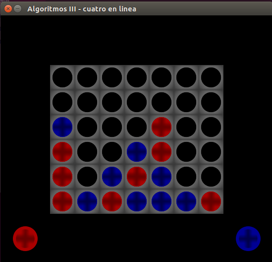

# Connect 4 AI
An implementation of a bot player for a generalization of the famous game 'Connect 4', where the board dimensions and the length of the line to form are custom. This project was part of the course 'Algorithms and Data Structures III' given at the [University of Buenos Aires](https://www.dc.uba.ar); its original repository is private and contains other things apart from the player and game themselves. This is a public version of it (currently working on it) that aims to be cleaner and let the project keep growing. There are some things in Spanish and other in English, sorry about that.



The implementation of the game (all the python scripts) was originally provided by the teachers of the course, as that was not the purpose of the project but the design of the players.

### Usage and dependencies
The bots are made in C++, and their source codes can be found in `ai/`. The game and its interface are made in Python 2, using [pygame](https://www.pygame.org/). That's the one and only non-standard dependency of the project. Pygame can be installed with pip:

```
sudo pip install pygame
```


*Note: make sure you are using Python 2.*

The game can be run from  `game/c_linea.py` using different arguments. For more information run it using `--help`. It's important to do it in its directory; for instance:

```console
uba@dc:~/connect4-AI/game$ python c_linea.py --help
``` 

### How the AIs work

The referee made in python interacts with the binaries compiled from the C++ code through standard input/output. At the beginning of each game, the AI receives the game rules (board dimensions, winning-line-length and who starts); to play, the AI sends the column number to the referee, and then receives the opponent's move. The way this is encoded is very simple, and I shall document it in the future.

### How the AIs really  work
There are two types of artificial intelligence:

#### Minimax
This is a perfect player from the game theory perspective. It works with the famous [minimax algorithm](https://en.wikipedia.org/wiki/Minimax), and can only be beaten if played perfectly. The downside of it is its algorithm complexity, as the problem is NP-hard. Because our board can be as big as we want, we want a scalable bot.

For those into game theory, there's an implementation using the alpha-beta pruning.

#### Genetic greedy
This is not a perfect player, but it runs much faster. Unlike Minimax, the greedy player does not study all possible outcomes of the game, but takes its decision based only on the actual state of the board (and maybe the next possible play).

The main idea of the algorithm is to rate all the boards that can be obtained and go for the one with the highest score. Roughly, a board state has different features defined, each of which has an associated weight, determining how important that feature is and how it impacts on the score. The AI takes arguments indicating those weights; this is where the genetic part comes in, and those arguments are trained using two techniques: 

* Grid search: an exhaustive search that looks for the best combination of arguments that make the AI work in the best way. This is infeasible, so some heuristics are applied in the search.
* Evolutionary optimization: a search based on iterating over populations of players, that evolve based on the best players of each past generation.

Note that this means the greedy binary needs arguments. Will not work if less than the needed number is passed.

Both the player algorithm and the [hyperparameter optimization](https://en.wikipedia.org/wiki/Hyperparameter_optimization) are complex to explain here, but I plan to adapt and extend the original report (~50 pages long) in the future.
